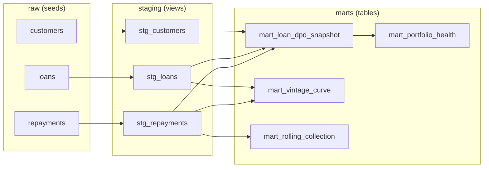

# Architecture

Three layers, built and tested by dbt on BigQuery.

- **raw** — three seeded CSVs loaded as-is.
- **staging** — one view per source table; clean, cast, rename.
- **marts** — aggregated tables the dashboards query.

`mart_portfolio_health` reads `mart_loan_dpd_snapshot` instead of recomputing
DPD, so the segment KPIs and the per-loan snapshot can never disagree.

A separate Python script (`data_generator/validate_marts_offline.py`) recomputes
the DPD buckets and segment rates straight from the CSVs. It never touches
BigQuery, so matching numbers confirm the SQL rather than restate it.
